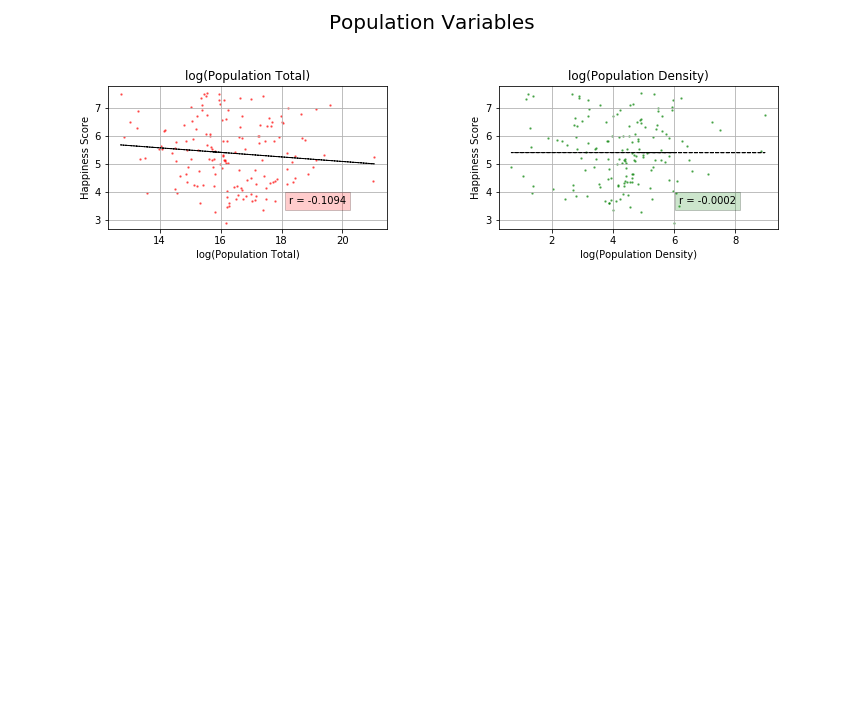

Project 1: Happiness Analysis

In this project, we would like to find the relationship between happiness score which was drawed from a poll and some accounted factors to have a good prediction for happiness index in the world.

The impacts are counted in this analysis including:

  GDP/PPP
  Population Total/Population Density
  Median Age
  Alcohol Consumption
  Level of Education 
  Internet Access
  Disaster Risk
  Amount of Sleep
  
  After the analysis, we discover the relationship between these factors as follow:
  
    Factors with strong correlation to country happiness score:
    
      Median Age, Education Level, Access to Internet.
      
    Factors with some correlation to country happiness index:
    
      GDP/PPP, Alcohol Consumption, Disaster Risk rate, Average Sleep
      
    Factors with no correlation to country happiness index:
    
      Population.

   
  
  
  
  
